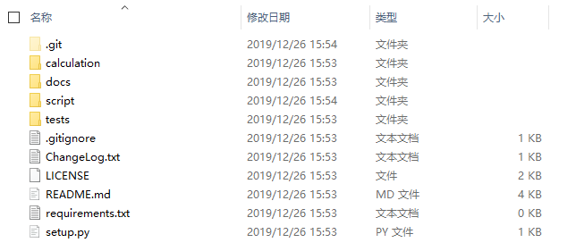

[]()

# 从菜鸟到菜鸡

## 前言

到目前为止，也不敢说自己很专业。觉得自己和专业还是有着很大的区别，只能说迈出了从业余到专业的一步。
来的这段时间里，在公司张总的悉心指导下，自己的能力无论从那个方面来讲，确实都得到了很大的提升，一步一步的从菜鸟到菜鸡。

## 初识

在一次偶然的机会下，张总了解到我会&#8194;Python，然后我就开始了自己第一个的完整项目：用&#8194;Python&#8194;实现简单计算器（类似于&#8194;windows&#8194;系统上的）。

## 第一次

第一次给他看效果的时候，我那时候是有点沮丧的，因为自己写的程序并不是他想要的那种&#8194;GUI，而是控制台类似的输入输出，所以得到的反馈结果并不是很好。

## 第二次

第二次使用了&#8194;Tkinter&#8194;实现了最简单的那种标准型计算器（包括加减乘除取余取整等），但相比于&#8194;windows&#8194;计算器，还是少了 +/- 退格等许多功能，在提交之后，虽然效果不错，但是功能还是太单调，相比于&#8194;windows&#8194;计算器，还少了科学型、程序员型、日期计算等。

第一次对比：


仅从这两张图片就可以看出，在除了界面之外，功能上确实少了许多东西。

## 第三次

在之前的基础上加上了科学型、程序员型、和日期计算之后。再一次的提交之后，张总再一次说出了这个项目中存在的诸多缺点。

1. 对于&#8194;Python&#8194;的命名规则缺少最基本的认识。------解决方法：查看书籍《Python从小白到大牛》
2. 没有文档注释，会让别人一头雾水，甚至无法下手。------解决方法：查看书籍《Python从小白到大牛》
3. 细节不够完美。------解决方法：优化代码
4. EXE文件可否去掉控制台。------解决方法：```pyinstaller -F XXX.py -w```

对于以上问题，回去我又仔细地的阅读与查看标准规范，重新修改代码。

这是之前与修改过后的页面的对比：  

  

可以看到功能基本实现，但是界面依然很是丑陋。在这个过程中，可以说算是整个项目中最难的时候，半吊子出家，从没有学过，甚至接触过，手上也没有现成的资料，只有去网上找官方文档，找别人走过的路，尽管如此，网上的有用信息依然很少和零散，仿佛大海捞针一样，一点一滴的将所有有用的信息拼接起来。

这是我代码的目录以及文件名：


如果我不是开发者，我都不知道哪一个是我自己的项目，更不要说别人看见这个文件夹了。

## 这一次

在后来的一段时间里，张总前前后后对我的项目提出了很多修改建议。包括但不限于：

1. 进行代码重构，冗余代码进行去除，必不可少的进行重构。
2. Python&#8194;语法规范，命名规则以及导入规范。（python编码规范请遵循[PEP8](https://www.python.org/dev/peps/pep-0008/
)）
3. Python&#8194;思想和其他语言思想的不同之处在于什么地方。
4. 文档注释和函数注释应该说些什么，怎么写才更规范。
5. 分模块撰写，代码的[高内聚和低耦合](https://baike.sogou.com/v35654126.htm?fromTitle=%E9%AB%98%E5%86%85%E8%81%9A%E4%BD%8E%E8%80%A6%E5%90%88)。
6. 版本号的命名等
7. ..........

我之前写代码的时候很少去考虑上面这些问题。但是后来了解之后，明白以上这些都是将要去思考和解决的问题。例如不去遵守函数和模块命名规则，写出来的代码阅读性差，让人摸不清头脑哪里才是函数的入口，除了我也没有人会去阅读这样的一份代码。而且可移植性差，别人要是想用，会产生一系列的bug。在团队协作中，这样的代码往往是会被大家所摒弃的。张总说了，一份好的代码，功能实现是最基本的，在此之上,还有许多重要的因素决定这个项目的好坏，一个人的方法和效率远远的低于一个团队，所以，代码的规范、整洁、可读、可维护、可移植性等在团队开发时就显得尤为重要了，那么，如果一份代码仅仅是只有自己可以看懂读懂，这份代码将会一文不值。

这两张图片是再修改之后的文件结构：

第一版：  
  

第二版：  
  

## 后来

再后来，张总建议我换一个开发平台。所以我从&#8194;Pycharm&#8194;换到&#8194;Anaconda&#8194;上的&#8194;VS code，一个新环境意味着前期的不习惯和不断的设置，修改。所幸，这个平台上有许多非常好用的插件可以解决这个烦恼。而且最重要的就是可以将项目通过几次点击就可以推送至&#8194;github&#8194;上，让更多的人去参与其中。至于为什么要将项目开源：可以看看这个  [为什么要开源](https://www.zhihu.com/question/33573424)？我觉得其中的回答很&#8194;nice&#8194;。当然，一个项目的开源意味着你将展示你的代码，要想别人获得一份好的阅读体验，那么，文件结构必须更加的清晰明了，让别人一目了然。虽然在这个过程中，少不了新工具的使用和不断的调试、优化，但是结依然是让人兴奋的。

最终上传至&#8194;github&#8194;上的文件结构：  



最后一次的对比：  


## 写在最后

王国维在《人间词话》中就曾说过关于学习境界的。

古今之成大事业、大学问者，必经过三种之境界。

1. “昨夜西风凋碧树。独上高楼，望尽天涯路”，此第一境也。
2. “衣带渐宽终不悔，为伊消得人憔悴”，此第二境也。
3. “众里寻他千百度，回头蓦见（当作‘蓦然回首’），那人正（当作‘却’）在灯火阑珊处”，此第三境也。

我所理解的就是知之，行之，述之。

1. 知之境界：你只是整体看了一遍，有了个大概的印象，这时候的学习对象对你来说就像是雾里看花般，朦朦胧胧。
2. 行之境界：你从零开始，把学习对象给拆散了，揉碎了，一块一块的去熟悉它，不断地练习去掌握它。
3. 述之境界：你要把之前拆散揉碎的知识给融合起来，梳理其中的脉络。不但要知道&#8194;what&#8194;和&#8194;how&#8194;，还要知道&#8194;why。这个阶段的总结回顾，最好的办法就是「输出」。做分享、写博客、参加研讨会等等，这些都是为了在输出的过程中，不断的引导自己区进一步的总结和反思。

## 参考

1. <https://zhuanlan.zhihu.com/p/19859309>
2. <https://www.zhihu.com/question/33573424/answer/57412434>
